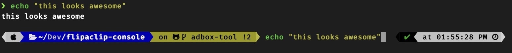

# How to install Oh my ZSH on mac and make it look sweet. 




## Install Oh My Zsh: 
```sh
sh -c "$(curl -fsSL https://raw.githubusercontent.com/robbyrussell/oh-my-zsh/master/tools/install.sh)"
```
## Install Powerlevel10k Theme:
```sh
git clone https://github.com/romkatv/powerlevel10k $ZSH_CUSTOM/themes/powerlevel10k
``` 
## Install Auto Suggestions Plugin:
```sh
git clone https://github.com/zsh-users/zsh-autosuggestions $ZSH_CUSTOM/plugins/zsh-autosuggestions
``` 

## Install Syntax Highlighting:
```sh
git clone https://github.com/zsh-users/zsh-syntax-highlighting $ZSH_CUSTOM/plugins/zsh-syntax-highlighting
```

## Install Micro ( or use VIM, etc):
```sh
sudo curl https://getmic.ro/ | bash
```
## Open your .zshrc file:
```sh
./micro ~/.zshrc
```

## Set Theme (Include the quotes " "):
### "powerlevel10k/powerlevel10k"

## Activate Enable Correction:
### ENABLE_CORRECTION="true" 

## Add our plugins:
### plugins=(git zsh-autosuggestions zsh-syntax-highlighting) 

## Save:
### CTRL + Q and then type Y to save 


## Download Nerd Fonts:
1. [https://www.nerdfonts.com](https://www.nerdfonts.com/)
2. Download the recommended [Font](https://github.com/ryanoasis/nerd-fonts/releases/download/v2.1.0/FiraMono.zip)
3. Open the folder that was just downloaded and install Fura Mono Complete by double clicking it. 
4. Open your Terminal preferences and change the font to the one we just downloaded.  
5. Close and restart the terminal.
6. Follow the setup wizard and you are done! 
